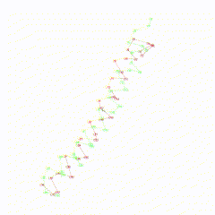

# compare_protein_structures
In this project i created a small script, which takes to protein coordinate file (.xyz) bring them into superposition and calculate the RMSD from scratch. [in R]

## Output
"Center of mass" 
0.1704857 -0.5047143 -0.4091143 
9.161229  -7.341657 -10.584857 
 
"Radius of gyration" 
25.60524 
26.07093 
 
"RMSD" 
5.149564 

## Example of superalignment
